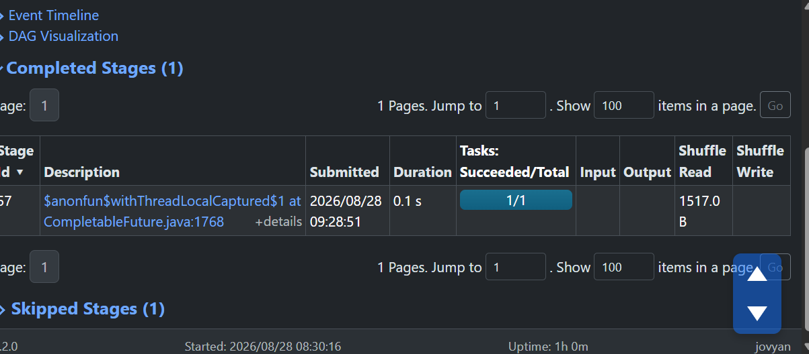
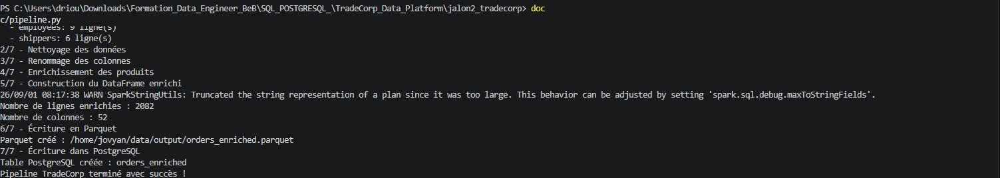
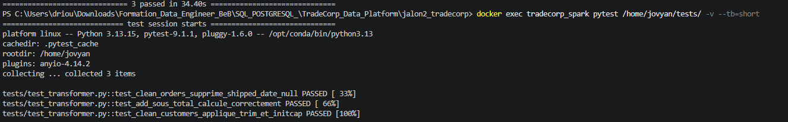

#Lancer le notebook jupyter:
#docker logs tradecorp_spark 2>&1 | findstr token
# TradeCorp Data Platform — Jalon 2

## Présentation

Ce projet met en place un pipeline ETL avec PySpark pour traiter les données commerciales de TradeCorp.

Le pipeline permet de :

- lire les fichiers CSV sources ;
- nettoyer et valider les données ;
- effectuer des jointures et des agrégations ;
- utiliser des Window Functions ;
- produire des fichiers Parquet ;
- charger le résultat final dans PostgreSQL ;
- tester les transformations avec pytest.

## Technologies utilisées

- Python
- PySpark
- PostgreSQL
- Docker et Docker Compose
- JupyterLab
- pgAdmin
- pytest

## Structure du projet

```text
jalon2_tradecorp/
├── captures/
├── data/
│   ├── raw/
│   ├── tmp/
│   └── output/
├── notebooks/
│   ├── 01_exploration.ipynb
│   ├── 02_nettoyage.ipynb
│   └── 03_transformations.ipynb
├── src/
│   ├── reader.py
│   ├── transformer.py
│   ├── writer.py
│   └── pipeline.py
├── tests/
│   └── test_transformer.py
├── Dockerfile
├── docker-compose.yml
└── README.md
```

## Prérequis

- Docker Desktop
- Visual Studio Code
- Git

## Lancement du projet

Depuis le dossier du projet :

```powershell
docker compose up -d --build
docker compose ps
```

Les trois conteneurs suivants doivent être actifs :

- `tradecorp_spark`
- `tradecorp_postgres`
- `tradecorp_pgadmin`

## Accès aux services

- JupyterLab : http://localhost:8888
- Spark UI : http://localhost:4040
- pgAdmin : http://localhost:8086
- PostgreSQL depuis Windows : `localhost:5434`

Pour récupérer le jeton Jupyter :

```powershell
docker logs tradecorp_spark 2>&1 | findstr token
```

## Configuration pgAdmin

Connexion à pgAdmin :

- Email : `admin@tradecorp.com`
- Mot de passe : `admin`

Configuration du serveur PostgreSQL :

- Host : `postgres`
- Port : `5432`
- Database : `tradecorp`
- Username : `postgres`
- Password : `postgres`

## Notebooks

Les analyses sont réparties dans trois notebooks :

1. `01_exploration.ipynb` : chargement et exploration des données.
2. `02_nettoyage.ipynb` : nettoyage, typage et contrôles qualité.
3. `03_transformations.ipynb` : jointures, agrégations, Window Functions, Parquet et PostgreSQL.

## Exécution du pipeline

```powershell
docker exec tradecorp_spark spark-submit --packages org.postgresql:postgresql:42.7.0 /home/jovyan/src/pipeline.py
```

Le pipeline produit notamment :

```text
data/output/orders_enriched.parquet/
data/output/orders_by_country/
```

Il crée également la table PostgreSQL :

```text
orders_enriched
```

## Exécution des tests unitaires

```powershell
docker exec tradecorp_spark pytest /home/jovyan/tests/ -v --tb=short
```

Résultat attendu :

```text
3 passed
```

## Vérification de PostgreSQL

```powershell
docker exec tradecorp_postgres psql -U postgres -d tradecorp -c "SELECT COUNT(*) FROM orders_enriched;"
```

Le résultat attendu est de `2082` lignes.

## Captures d’écran

### Spark UI



### Exécution du pipeline avec spark-submit



### Tests unitaires



## Arrêt du projet

```powershell
docker compose down
```

Pour supprimer également les volumes PostgreSQL :

```powershell
docker compose down -v
```